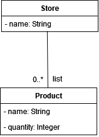
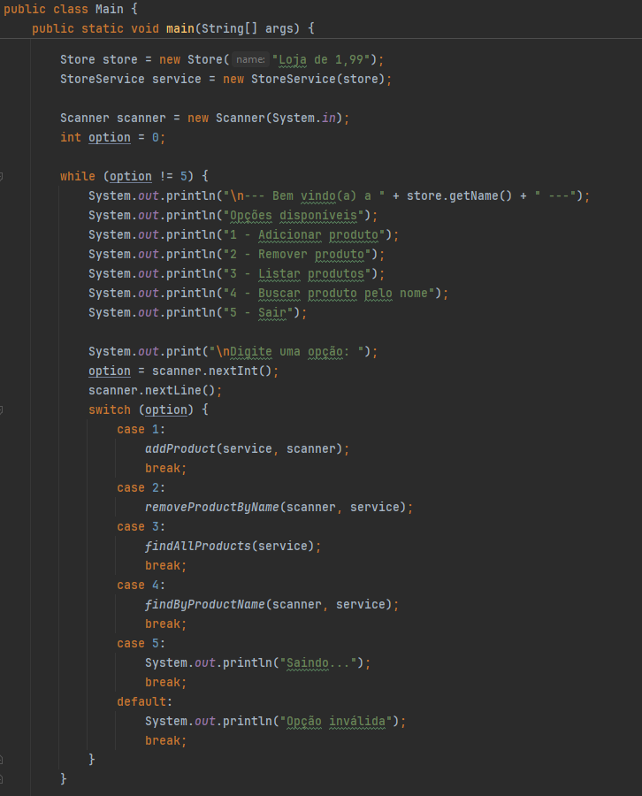
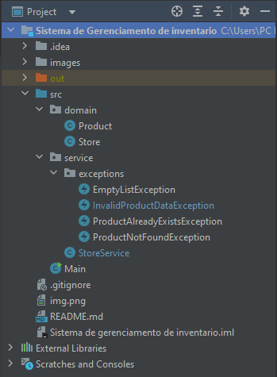
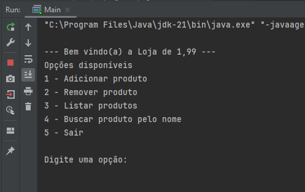

# Projeto Prático Tinnova - Sistema de Gerenciamento de inventário

Este projeto foi desenvolvido como parte do processo seletivo da Tinnova. O objetivo é criar um sistema de gerenciamento de inventário, onde é possível cadastrar, atualizar, deletar e listar produtos.

## Tecnologias utilizadas

- Java 21
- IntelliJ IDEA

## Pré-requisitos para rodar o projeto

Para utilizar o projeto é necessário apenas ter o Java 21 instalado na máquina.

# Estrutura do projeto

 O projeto está estruturado em camadas, sendo elas: 
 - Domain: Onde contém as entidades do sistema, Store e Product;
 - Service: Onde contém as regras de negócio do sistema;

# Observações

1. O projeto contém o tratamento de exceções a nível de serviço, isso quer dizer que as exceções são tratadas no momento em que o serviço é chamado, e não no método principal (Main). Isso foi feito para que eu pudesse demonstrar o conhecimento em tratamento de exceções.
2. O diagrama de classes que fiz não contém o relacionamento de Produto conter um Store, pois achei que não era necessário para o projeto.

## Como rodar o projeto

Para rodar o projeto basta executar o arquivo Main.java que está localizado em src/Main.java no IntelliJ IDEA ou em qualquer outra IDE de sua preferência.

# Diagrama de classes

### Método Main

 

### Estrutura de pacotes
 
 

### Menu rodando
